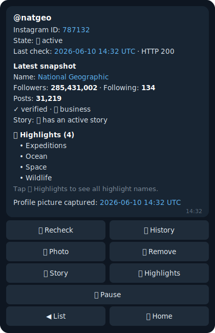

<div align="center">

# 👁 The Watcher

### Instagram monitoring, delivered to your Telegram. 100% login-free.

Track any Instagram account — **public or private** — followers, bio, profile picture, stories, posts, reels — and get every change **plus the actual media** dropped straight into your chat. No Instagram account. No cookies. Nothing that can get banned.

**Battle-tested in production: one instance quietly watching 25+ accounts, around the clock.**

[](https://python.org)
[](https://fastapi.tiangolo.com)
[](https://core.telegram.org/bots)
[](https://postgresql.org)
[](Dockerfile)
[](LICENSE)

[Quick Start](#-quick-start-local) · [Features](#-features) · [Deploy to Render](#-deploy-to-render) · [Commands](#-telegram-commands--menus) · [HTTP API](#-http-api)



<sub>*An account card, live in Telegram. Every feature is one tap away.*</sub>

</div>

---

## Why The Watcher?

- 🕵️ **Truly anonymous.** Works with zero Instagram credentials — no account, no session cookie, no device fingerprint tied to you. There is nothing for Instagram to ban.
- 🔒 **Private accounts too.** Follower/following/post counts, bio, name, username, profile picture, and privacy flips are tracked even for private accounts — anonymously. (Media delivery applies to public accounts; private content is never accessed.)
- 🎬 **It doesn't just notify — it delivers.** New stories, posts, reels, highlights, and profile pictures arrive in your chat as actual photos and videos, not links.
- 📦 **One tap grabs a whole account.** The **Download all** panel pulls the story, photos, reels, every highlight, and the profile picture of any public account — all of it, or just the parts you tick.
- 📲 **Telegram is the entire UI.** Add targets, pause them, pull stories, tune the schedule, export history — all through inline buttons. You never touch a terminal after deploy.
- ☁️ **Datacenter-proof.** Instagram 401-blocks cloud-host IPs wholesale; The Watcher routes **every** Instagram API call through a free Cloudflare Worker at the edge — IPs Instagram doesn't block — with a direct-request fallback and an anonymous media downloader as a second, independent path. Render, Fly, any VPS: it just works.
- ⚡ **Proven at scale.** A single instance sweeps 25+ accounts around the clock — with jittered scheduling and throttled concurrency so it never trips rate limits.
- 📦 **One container, five minutes.** A single Docker image with a `render.yaml` blueprint — database, persistent disk, and webhook included. Runs on a free-tier box.

---

## ✨ Recently Shipped

| | |
|---|---|
| 🛰 **Every Instagram call rides the edge** | Story/live status, highlight names, and `/add` by numeric ID now go through the same free Cloudflare Worker proxy as profile fetches — so they work flawlessly from cloud hosts whose IPs Instagram 401-blocks. Repeated lookups are served from a 90-second cache, and retry storms against blocked endpoints are gone. |
| 🪶 **Featherweight database** | Each snapshot now stores ~300 bytes instead of Instagram's full 50–200 KB payload — ~99% smaller. A free 0.5 GB Postgres now lasts effectively forever. |
| 🔄 **Full-coverage rechecks** | A manual recheck (🔄 button, `/recheck`, REST endpoint) now covers exactly what a scheduled sweep covers: profile diff, new posts & reels, story & live status, highlight catalog changes, and new story/highlight media delivery. |
| 📦 **Bulk download — a whole account in one tap** | New home-menu button. Pick a monitored account or type any username, profile URL, or numeric ID, then tick exactly what you want — 📖 story, 🖼 photos, 🎬 reels, 👤 profile picture, and each highlight by name — or hit **⚡ Download EVERYTHING**. Live per-category progress, a final summary, and zero login, like everything else. |
| 🔕 **Per-highlight tracking** | Choose exactly which highlights to follow, per account. Mute one, several, or all — muted highlights are skipped by the sweep's auto-download (and not even fetched), while manual downloads keep working. Unmuting resumes cleanly from now, without dumping everything posted in between. |
| 🖼 **Post & reel auto-delivery** | Every sweep detects new posts/reels and sends the actual media to your chat — capped at 5 per sweep so a posting spree never floods you. First sweep baselines silently (no backlog dump). |
| ⏸ **Pause / resume targets** | Freeze monitoring with one tap or `/pause` — history, snapshots, and the resolved Instagram ID are all preserved. Resume picks up exactly where it left off. |
| 🔎 **Any public account, on demand** | `/story @user` and `/highlights @user` grab media from **any** public account — no need to monitor it. Also available as the **🔎 Any user** menu button. |
| ⬇️ **Download-all highlights** | One button fetches every highlight of an account, full quality. |
| 🔴 **Live & story status** | The account card shows `🔴 live now` / `🎬 has an active story` in real time — checked at the moment you open the card, not at the last sweep. |
| 🖼 **Max-quality profile pictures** | Full-resolution avatars instead of the 320 px anonymous ceiling, with automatic fallback for accounts the high-res path can't reach. |
| ⚡ **Faster everywhere** | Downloader tokens are cached, blocked endpoints fast-fail instead of timing out, and account cards render instantly. |

---

## How It Works

The Watcher runs as a single container. It connects to your Telegram bot, sweeps a list of Instagram targets on a schedule, diffs each profile against its last snapshot, and pushes changes — with media — to your chat.

```
 Telegram chat ──► commands & inline menus ──► FastAPI + APScheduler
                                                      │  sweep
                                 ┌────────────────────┴────────────────────┐
                                 ▼                                         ▼
                  Instagram API (web + graphql)              Anonymous media downloader
              via Cloudflare Worker edge proxy · 90s cache   stories · highlights · posts
           (profile fields, story/live status, highlights)   reels · full-res avatars
                                 └────────────────────┬────────────────────┘
                                                      ▼
                                                 PostgreSQL
                                    snapshots · diffs · media hashes · dedup
                                                      │  change detected
                                                      ▼
                                                  Telegram
                                       formatted alert + photos/videos
```

Two independent data paths mean one being blocked never takes the bot down: profile fields and story/live/highlight **status** come from Instagram's own API, routed through a free Cloudflare Worker on edge IPs Instagram doesn't block (with a Chrome-TLS-fingerprint direct fallback for local runs), while story/post/reel **media** flows through a login-free third-party downloader that cloud IP blocks don't touch.

---

## 🚀 Features

### Change Detection
- Tracks 10+ profile fields: followers, following, posts, reels, highlights, biography, full name, username, external link, verification badge, business flag, public/private status
- **Works on private accounts** — all profile-level fields above are tracked for private targets, including an alert the moment an account goes private or public
- Profile-picture change detection — every avatar is SHA-256 hashed and archived to disk
- Story & live status surfaced on every sweep and live-checked when you open an account card
- Highlight catalog tracking — detects added, renamed, and removed highlights by name
- Sweep-complete summary after every run, so you always know the bot is alive

### Media Delivery
- **New posts & reels** auto-downloaded and sent as photos/videos the sweep they appear
- **Stories** fetched and delivered with per-item deduplication — each story is sent exactly once
- **Highlights** listed by name with per-highlight download buttons and a download-all option
- **Per-highlight mute** — 🔕 toggle any highlight (or mute/track all at once) to control exactly what the sweep auto-downloads; muted ones are marked on the account card and skipped without being fetched
- **Profile pictures** in maximum available resolution, on demand via `/fetchphoto`
- **📦 Bulk download** — one panel grabs a whole account: story, photos, reels, profile picture, and any (or all) highlights, with checkbox selection or a one-tap **⚡ EVERYTHING** button
- All media retrieval is **login-free** — no Instagram session is ever used

### On-Demand Lookups
- `/story @user` and `/highlights @user` work on **any public account**, monitored or not
- **🔎 Any user** menu button does the same with zero typing
- **📦 Download all** menu button bulk-grabs any account — monitored or not — by username, profile URL, or numeric Instagram ID

### Target Management
- Add targets by `@username`, full profile URL, or raw numeric Instagram ID
- Pause/resume per target — paused accounts keep their entire history and resolved Instagram ID
- Paginated account list with live 🟢 / ⏸ state markers
- Per-target forced recheck, change history, and stored-photo retrieval

### Reliability
- **Every Instagram API call routed through a Cloudflare Worker edge proxy** (free tier, 100k req/day) — cloud-host IP blocks never reach the bot; falls back to direct requests if the proxy is down
- Chrome TLS fingerprint impersonation (`curl_cffi`) to clear 401/403 walls on the direct path
- 90-second reel-data cache — sweeps and card opens never re-ask Instagram for the same data
- Fast-fail circuit breaker on blocked endpoints instead of retry storms
- Cached downloader tokens — the three-step token handshake runs once, not per request
- Tenacity retries with exponential backoff; debounced failure alerts (no 429 spam)
- Consecutive-failure counter per target, visible in `/status` and `/list`

### Data & API
- PostgreSQL persistence: snapshots, media hashes, notification log, seen-item dedup, runtime settings
- **Featherweight snapshots** — ~300 bytes stored per check instead of Instagram's 50–200 KB raw payload, so a free 0.5 GB database lasts for years
- Configurable retention windows + a **Clear Old Data** button right in the bot
- HTTP API with liveness/readiness probes and a cron-compatible `/sweep` endpoint
- Token-gated mutation endpoints; CSV export of the full notification history

---

## 🏁 Quick Start (Local)

**Prerequisites:** Python 3.12+, a PostgreSQL instance (local or remote)

```bash
# 1. Clone
git clone https://github.com/m0hx65/The_Watcher3.0.git
cd The_Watcher3.0

# 2. Configure
cp .env.example .env
# Edit .env — set TELEGRAM_BOT_TOKEN, TELEGRAM_CHAT_ID, DATABASE_URL

# 3. Install
python -m venv .venv
source .venv/bin/activate        # Windows: .venv\Scripts\activate
pip install -r requirements.txt

# 4. Run
uvicorn app.main:app --reload --port 8000
```

The bot starts in long-polling mode (no public URL required). Send `/add <username>` to your bot and you're monitoring.

---

## 🐳 Docker

```bash
docker build -t the-watcher .

docker run -d \
  --name watcher \
  --restart unless-stopped \
  -p 8000:8000 \
  -v watcher-media:/app/data/media \
  --env-file .env \
  the-watcher
```

The container exposes `/health` and ships a built-in `HEALTHCHECK`.

---

## ☁️ Deploy to Render

The `render.yaml` blueprint provisions everything automatically.

1. Fork this repository.
2. Create a free **[Neon](https://neon.tech)** Postgres (free tier, no card, and
   — unlike Render's free database — it doesn't expire). Copy its connection
   string; it can be pasted in verbatim (the `postgres://` prefix and
   `sslmode`/`channel_binding` params are normalized for asyncpg automatically).
3. In Render: **New +** → **Blueprint** → select your fork. Render provisions:
   - A Docker web service
   - A 1 GB persistent disk at `/app/data` for stored profile pictures
4. Set the secrets in the Render dashboard:

   | Variable | Value |
   |---|---|
   | `TELEGRAM_BOT_TOKEN` | Token from [@BotFather](https://t.me/botfather) |
   | `TELEGRAM_CHAT_ID` | Your chat or channel ID |
   | `TELEGRAM_ADMIN_IDS` | Comma-separated Telegram user IDs (optional) |
   | `DATABASE_URL` | Your Neon connection string |

   `WEB_API_TOKEN` is auto-generated by Render.

5. Click **Deploy**. The service registers a Telegram webhook on its public URL and starts sweeping immediately — Instagram's cloud-IP blocks are bypassed out of the box: `render.yaml` presets `IG_PROXY_URL` to a Cloudflare Worker edge proxy that carries every Instagram API call.

> **Already running on Render's free Postgres?** It expires ~30 days after
> creation. Move your data to Neon with zero loss using
> [`scripts/migrate_db.py`](scripts/migrate_db.py) — see the runbook at
> [docs/2026-06-11-neon-db-migration.md](docs/2026-06-11-neon-db-migration.md).

### Optional: External Cron Trigger

Render's free tier may suspend the service between requests. Use a Render Cron Job or any external scheduler to keep sweeps firing:

```bash
curl -fsS -X POST https://<your-service>.onrender.com/sweep \
  -H "X-API-Token: $WEB_API_TOKEN"
```

---

## ⚙️ Configuration

All settings come from environment variables. Copy `.env.example` to `.env` for local development.

### Required

| Variable | Description |
|---|---|
| `TELEGRAM_BOT_TOKEN` | Token from [@BotFather](https://t.me/botfather) |
| `TELEGRAM_CHAT_ID` | ID of the chat or channel that receives alerts |
| `DATABASE_URL` | PostgreSQL connection string — `postgres://`, `postgresql://`, and `postgresql+asyncpg://` are all accepted |

### Telegram

| Variable | Default | Description |
|---|---|---|
| `TELEGRAM_ADMIN_IDS` | _(empty)_ | Comma-separated user IDs allowed to use the bot. Empty = allow all |
| `TELEGRAM_WEBHOOK_URL` | _(empty)_ | Public base URL for webhook registration. Auto-inferred from `RENDER_EXTERNAL_URL` on Render |
| `TELEGRAM_WEBHOOK_SECRET` | _(empty)_ | Optional secret validated against Telegram's `X-Telegram-Bot-Api-Secret-Token` header |
| `TELEGRAM_WEBHOOK_PATH` | `/telegram/webhook` | Webhook path registered with Telegram and mounted by FastAPI |

### Scheduler

| Variable | Default | Description |
|---|---|---|
| `CHECK_INTERVAL` | `1800` | Seconds between full sweeps |
| `JITTER_SECONDS` | `120` | Maximum random seconds added to each interval |
| `MAX_CONCURRENT_FETCHES` | `3` | Max parallel profile fetches per sweep |
| `REQUEST_TIMEOUT` | `20` | Per-request timeout in seconds |

### Storage & Retention

| Variable | Default | Description |
|---|---|---|
| `MEDIA_DIR` | `./data/media` | Directory for downloaded profile pictures |
| `SNAPSHOT_RETENTION_DAYS` | `30` | Days to keep account snapshots. `0` = keep forever |
| `NOTIFICATION_RETENTION_DAYS` | `90` | Days to keep notification logs |
| `RAW_RESPONSE_RETENTION_DAYS` | `7` | Days to keep raw Instagram API responses |

### Instagram

| Variable | Default | Description |
|---|---|---|
| `IG_SESSION_COOKIE` | _(empty)_ | **Optional** — full cookie string from a logged-in browser session. The bot is fully functional without it; login-free is the default and recommended mode |
| `IG_PROXY_URL` | _(empty)_ | Cloudflare Worker that proxies **all** Instagram API calls — profile fields, story/live status, highlight catalog, ID-to-username resolution. Strongly recommended on cloud hosts (preset in `render.yaml`); without it the bot makes direct requests, which datacenter IPs usually get 401-blocked on |

### Proxy & Network

| Variable | Default | Description |
|---|---|---|
| `PROXY_URL` | _(empty)_ | Outbound proxy for all requests (`http://...` or `socks5://...`). Overrides `HTTP_PROXY`/`HTTPS_PROXY` |
| `HTTP_PROXY` / `HTTPS_PROXY` | _(empty)_ | Standard proxy env vars (used when `PROXY_URL` is unset) |

### Web API & Runtime

| Variable | Default | Description |
|---|---|---|
| `WEB_API_TOKEN` | _(empty)_ | If set, required as `X-API-Token` header for `/sweep` and `/accounts/*/recheck` |
| `PORT` | `8000` | Web server port |
| `LOG_LEVEL` | `INFO` | Logging verbosity: `DEBUG`, `INFO`, `WARNING`, `ERROR` |

---

## 💬 Telegram Commands & Menus

| Command | Description |
|---|---|
| `/menu` | Open the main inline menu |
| `/add <target>` | Start monitoring — accepts `@username`, `https://instagram.com/username`, or a numeric Instagram ID. Runs an immediate baseline fetch |
| `/remove <user>` | Stop monitoring and delete all stored history (`/rm` is an alias) |
| `/pause <user>` | Pause monitoring — the target and its full history stay in the database |
| `/resume <user>` | Resume a paused target exactly where it left off |
| `/list` | All monitored accounts with 🟢 / ⏸ state, last-check status, and failure count |
| `/recheck <user>` | Force an immediate check outside the schedule |
| `/interval [value]` | Show or set the sweep interval — `30m`, `1h`, `1800s`, `1h30m`. No argument shows presets |
| `/status` | Global stats: accounts, last sweep, next scheduled sweep |
| `/history <user>` | Recent detected changes for a target |
| `/photo <user>` | Latest stored profile picture and its SHA-256 hash |
| `/fetchphoto <user>` | Download the current profile picture in max quality — works for any public account |
| `/story <user>` | Download any public user's **current story** — no monitoring required |
| `/highlights <user>` | List any public user's highlights with per-item download buttons |
| `/export` | Full notification history as CSV |
| `/help` | Command reference |

**Everything is also reachable through buttons** — no commands required:

- **Main menu** — Accounts · Status · Add · Interval · Export · Help · **🔎 Any user** · **📦 Download all** · **Sweep All**
- **Account card** — Recheck · History · Photo · Remove · **Story** · **Highlights** · **Pause ⇄ Resume**
- **Highlights view** — ⬇️ Download all (n), one download button per highlight, plus 🔕/🔔 mute toggles per highlight and a mute-all / track-all shortcut
- **📦 Bulk download panel** — asks whether the target is monitored (pick from the list) or not (type a username, URL, or ID), then shows checkboxes for 📖 Story · 👤 Profile pic · 🖼 Photos · 🎬 Reels · every highlight by name, with a select-all-highlights shortcut. **⬇️ Download selected** sends exactly what's ticked; **⚡ Download EVERYTHING** sends it all — with live per-category progress and a final summary
- **Status view** — Sweep Now · Interval · **Clear Old Data** (with confirmation)
- **Interval picker** — presets from 5 m to 6 h plus free-form custom entry
- **Panel bumping** — after every notification the menu re-posts at the bottom of the chat, so it's always within thumb's reach

---

## 🔌 HTTP API

All responses are JSON. Mutation endpoints require `X-API-Token` when `WEB_API_TOKEN` is configured.

| Method | Path | Auth | Description |
|---|---|---|---|
| `GET`/`HEAD` | `/health` | None | Liveness probe — returns `{"status":"ok"}` |
| `GET` | `/ready` | None | Readiness probe — checks monitor and scheduler state |
| `GET` | `/status` | None | Stats: account counts, last sweep time, scheduler info |
| `GET` | `/accounts` | None | List all monitored accounts |
| `POST` | `/accounts/{username}/recheck` | Token | Force an immediate check for one account |
| `POST` | `/sweep` | Token | Trigger a full sweep across all active accounts |

```bash
curl -X POST https://<host>/sweep -H "X-API-Token: your-token"
```

---

## 🗄 Data Model

Tables are created automatically on first boot via SQLAlchemy `create_all`.

| Table | Description |
|---|---|
| `monitored_accounts` | One row per target: username, resolved Instagram ID, active/paused flag, last status, failure count |
| `account_snapshots` | One row per fetch: all parsed profile fields, raw JSON response, HTTP status |
| `profile_media_hashes` | One row per unique profile picture (SHA-256 + disk path), deduplicated across accounts |
| `notification_logs` | One row per dispatched change event: type, payload, delivery status |
| `seen_stories` | Delivery dedup for stories, highlight items, **and posts/reels** — each media item is sent exactly once |
| `stored_highlights` | Per-account highlight catalog (id + title) used to detect added/renamed/removed highlights, with the per-highlight `tracked` mute flag |
| `app_settings` | Key-value store for runtime-tunable config persisted across restarts |

Pausing a target never deletes anything — the row, its Instagram ID, and all history survive until you explicitly `/remove`.

---

## 📁 Project Layout

```
app/
├── api/            HTTP API routes (FastAPI router)
├── bot/            Telegram command handlers, inline menus, notification dispatch
├── database/       SQLAlchemy models, async session, CRUD helpers
├── monitor/        Instagram client, anonymous media downloader, change detector, sweep orchestrator
├── utils/          Logging setup, user-agent rotation, formatting helpers
├── workers/        APScheduler-based sweep worker
├── config.py       Pydantic Settings — environment-driven configuration
└── main.py         FastAPI app, lifespan wiring, service initialization
Dockerfile
Procfile
render.yaml
requirements.txt
.env.example
```

---

## 🧰 Tech Stack

| Component | Library | Version |
|---|---|---|
| Web framework | FastAPI | 0.115 |
| ASGI server | Uvicorn | 0.32 |
| Instagram client | curl_cffi | 0.15 |
| HTTP client | httpx (HTTP/2) | 0.28 |
| Telegram | python-telegram-bot | 21.9 |
| Task scheduler | APScheduler | 3.10 |
| ORM | SQLAlchemy (async) | 2.0 |
| Database driver | asyncpg | 0.30 |
| Config | pydantic-settings | 2.7 |
| Retry | Tenacity | 9.0 |
| Logging | Loguru | 0.7 |
| Image processing | Pillow | 11.0 |

---

## ⚖️ Responsible Use

- The Watcher reads only what Instagram serves **anonymously** through undocumented, rate-limited endpoints. For private accounts that means profile metadata only — private stories, posts, and media are never accessed.
- Only monitor accounts you have a legitimate reason to track: your own accounts, brand assets, or authorized OSINT research.
- Increase `CHECK_INTERVAL` and reduce `MAX_CONCURRENT_FETCHES` for large target lists.
- 401/403/429 responses are surfaced to you (debounced), so you know immediately if you're being throttled.

---

## ⭐ Support the Project

If The Watcher saves you time, **[star the repo](https://github.com/m0hx65/The_Watcher3.0/stargazers)** — it's the easiest way to help others find it. Issues and PRs are welcome.

## 📄 License

[MIT](LICENSE) © 2026 [Mohamad (m0hx65)](https://github.com/m0hx65)
